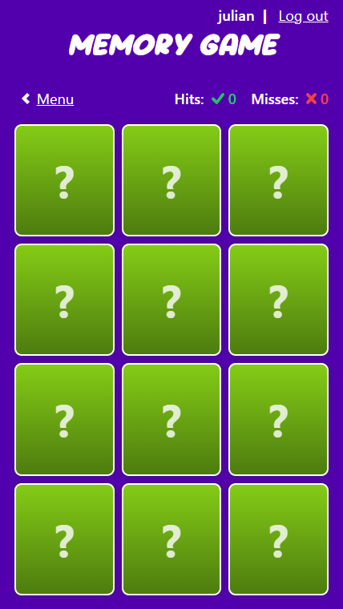

# Memory game

The classic memory game.



## Authors

- [@lucerojulian](https://www.github.com/lucerojulian)

## Tech Stack

_React_ / _TypeScript_ / _TailwindCSS_ / _Vitest_

## Demo

- [Vercel](https://memory-game-eight-zeta.vercel.app/)

## Run Locally

Clone the project

```bash
  git clone https://github.com/lucerojulian/memory-game
```

Go to the project directory

```bash
  cd memory-game
```

Install dependencies

```bash
  yarn
```

Run in development mode

```bash
  yarn dev
```

## Running Tests

We use [Vitest](https://vitest.dev/) for the tests in this project

To run tests, run the following command

```bash
  yarn test
```

## Deployment

Every time a push to **master** is done, the project will be deployed automatically

For the deployment are used [Vercel](https://vercel.com/).
